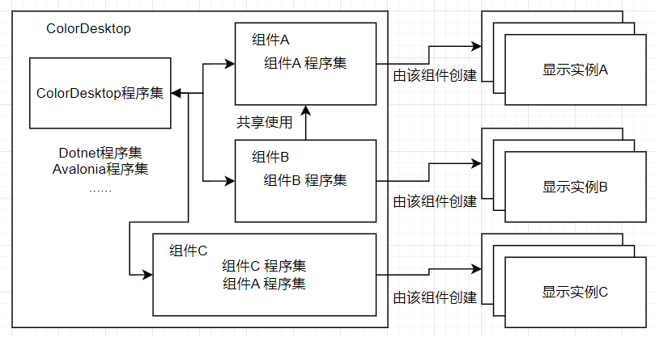
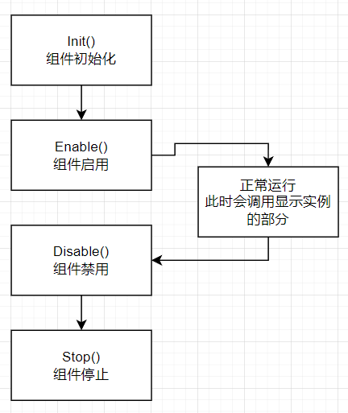
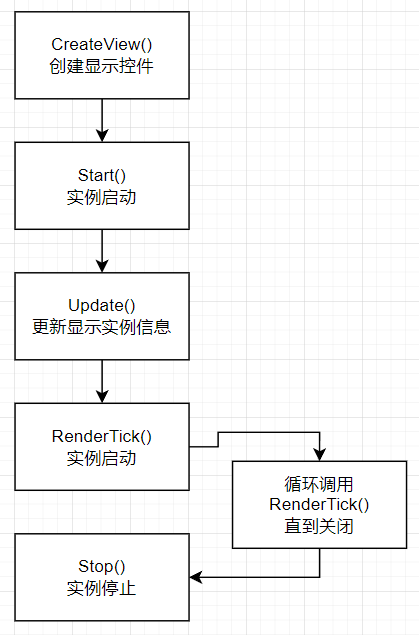

# 组件开发指南

这个是C#组件开发指南，[前往浏览器组件](./web.md)

在开发组件之前，你需要有以下知识
- [C# 12](https://learn.microsoft.com/zh-cn/dotnet/csharp/)
- [axaml](https://docs.avaloniaui.net/docs/basics/user-interface/introduction-to-xaml)
- [avalonia ui](https://docs.avaloniaui.net/)

还需要安装[.net8 sdk](https://dotnet.microsoft.com/en-us/download/dotnet)  
[git软件](https://git-scm.com/downloads)，与任意一个C#开发的IDE，本指南后面使用[VS2022](https://visualstudio.microsoft.com/zh-hans/vs/)作为示例

## 开发前准备

克隆源码
```
git clone https://github.com/Coloryr/ColorDesktop.git
```

构建一次`ColorDesktop.Launcher`
```
cd ColorDesktop
cd src
dotnet build 
```

此时，会构建到`./src/build_out/Debug/net8.0`，你可以在这里面找到`ColorDesktop.Launcher.exe`

然后是组件引用`ColorDesktop.Api`，有两种方式实现

- 使用源码的方式引用API  
1. 打开`ColorDesktop.sln`，在里面新建你的组件项目  
2. 修改`ColorDesktop.Debug`，并引用你的组件项目，
3. 修改`ColorDesktop.Debug`的`Program`函数`BuildAvaloniaApp`，在里面添加你的组件
```c#
new AnalogClockPlugin.AnalogClockPlugin().LoadLang(LanguageType.zh_cn);
```
你的组件类可能，没有，你可以后面再回来加，如果不加上会导致语言加载错误

- 使用Nuget包方式引用API  
1. 创建一个C# 类库工程
2. 安装[nuget包`ColorDesktop.Api`](https://www.nuget.org/packages/ColorDesktop.Api)  
3. 创建一个Avalonia项目，同时引用你的类库工程
4. 删除里面的所有`PackageReference`引用`Avalonia`项，例如
```xml
<!-- 这些全部删掉 -->
<PackageReference Include="Avalonia" Version="$(AvaloniaVersion)" />
<PackageReference Include="Avalonia.Themes.Fluent" Version="$(AvaloniaVersion)" />
<!-- 等... -->
```
5. 修改控制台应用的`Program`函数`BuildAvaloniaApp`，在里面添加你的组件
```c#
new AnalogClockPlugin.AnalogClockPlugin().LoadLang(LanguageType.zh_cn);
```
你的组件类可能，没有，你可以后面再回来加，如果不加上会导致语言加载错误

完成以上操作后，就可以开始开发组件了，同时若VS装上了`Avalonia预览插件`，也可以预览你的UI了  
**注意，如果使用nuget方式，则在预览中不会使用ColorDesktop的样式，但是组件加载后会使用**

## 组件与显示实例概念

`组件`是软件的附属，组件里面有用于操作与显示的内容  
`显示实例`是组件实例化的窗口，部分操作与显示都在这上面  
组件有`主页面`、`组件设置页面`与`组件实例设置页面`三种页面，`主页面`是必须要编写的，任何一个`组件`都必须包含一个主页面
例如我这个时钟组件（ColorDesktop.ClockPlugin）有三个页面
```
- 时钟页面ClockControl（主页面）
- 时钟设置页面ClockSettingControl（组件设置页面）
- 时钟实例设置页面ClockInstanceSettingControl（组件实例设置页面）
```
设置页面可以按需要编写    
例如我这个模拟时钟组件（ColorDesktop.AnalogClockPlugin）有两个
```
- 时钟页面AnalogClockControl（主页面）
- 时钟实例设置页面AnalogClockSettingControl（组件实例设置页面）
```  

每个组件程序空间隔离，但可以设置组件见`共享`或`加载`的依赖关系  
  
可以看到，组件A B C都由ColorDeskop加载，并且可以进行操作  
组件B可以共享使用组件A的程序集，但组件A不能共享使用组件B的程序集，这是共享依赖  
组件C可以独立加载组件A的程序集，但组件A不加载组件C的程序集，这是加载依赖  
**任何未标注依赖的组件都无法相互访问**  
组件都可以使用ColorDesktop的程序集（但是不推荐）

## 创建项目

创建一个C#运行库项目，目标SDK为.net8  
引用项目`./src/ColorDesktop.Api/ColorDesktop.Api.csproj`

为了方便调试，你可以在构建后自动讲插件复制到ColorDesktop的组件目录中去  
例如
```
<PropertyGroup>
	<TargetFramework>net8.0</TargetFramework>
	<ImplicitUsings>enable</ImplicitUsings>
	<Nullable>enable</Nullable>
	<AvaloniaUseCompiledBindingsByDefault>true</AvaloniaUseCompiledBindingsByDefault>
	<BaseOutputPath>..\build_out\Debug\net8.0\plugins\AnalogClockPlugin</BaseOutputPath>
	<ProduceReferenceAssembly>False</ProduceReferenceAssembly>
</PropertyGroup>
```

然后启动调试`ColorDesktop.Launcher`，若组件编写正确会自动加载dll与pdb文件

创建一个组件信息`plugin.json`
```json
{
    //冲突ID，不能和其他组件冲突
    "ID": "coloryr.analogclock",
    //组件名字
    "Name": "模拟时钟",
    //组件描述
    "Describe": "使用表盘方式显示系统时间，依赖与组件coloryr.clock",
    //组件作者
    "Auther": "Coloryr",
    //组件程序集，就是dll的名字，在这里可以添加你的依赖库等
    //这个列表里面是最先加载的，若你的运行库很多，可以不写，会后面自动加载
    "Dlls": [
        "ColorDesktop.AnalogClockPlugin" 
    ],
    //依赖的插件
    "Dependents": [
        {
            //依赖方式 Share共享 Load加载
            "Type": "Share",
            //依赖插件的ID
            "ID": "coloryr.clock"
        }
    ],
    //支持的操作系统
    "Os": [
        "windows_x86_64",
        "windows_arm64",
        "linux_x86_64",
        "linux_arm64",
        "macos_x86_64",
        "macos_arm64"
    ],
    //是否不需要请求权限就能让其他组件控制
    "Permission": true,
    //是否支持重载
    "Reload": true,
    //组件版本号
    "Version": "1.0.0",
    //API版本号
    "ApiVersion": "4"
}
```
然后设置编译后设置`编译后复制`，或者在工程内加入这段
```xml
<ItemGroup>
	<None Update="plugin.json">
		<CopyToOutputDirectory>PreserveNewest</CopyToOutputDirectory>
	</None>
</ItemGroup>
```

然后编写组件主入口类，需要实现接口[ColorDesktop.Api.IPlugin](./src/ColorDesktop.Api/IPlugin.cs)  
然后编写显示实例，需要实现接口[ColorDesktop.Api.IInstance](./src/ColorDesktop.Api/IInstance.cs)

## 组件生命周期  
  
组件相关的生命周期有四个函数  
- Init 只在组件初始化时调用，整个生命周期只会调用一次
- Enable 组件启用时调用，会多次调用，在[组件管理](./README.md#组件管理)界面下的`启用组件`就会调用这个
- Disable 组件卸载时调用，会多次调用，在[组件管理](./README.md#组件管理)界面下的`禁用组件`就会调用这个
- Stop 组件关闭时调用，整个生命周期只会调用一次，调用后组件会被卸载

## 显示实例生命周期  
  
显示实例相关的生命周期有五个函数  
- CreateView 只会调用一次，需要返回一个Avalonia的Control，及显示内容
- Start 只会调用一次，调用时窗口已经创建完毕
- Updatge 设置显示实例相关信息，例如UUID，插件ID等，这个函数在`设置显示实例`完成后都会调用一次
- RenderTick 开始更新与渲染，每帧调用一次
- Stop 只会调用一次，调用后窗口会被关闭

创建一个显示实例会调用`CreateInstanceDefault()`  
此时需要返回一个默认的显示实例配置  
```C#
return new InstanceDataObj()
{
    Nick = "模拟时钟",
    Plugin = "coloryr.analogclock",
    Pos = PosEnum.TopRight,
    Margin = new(5)
};
```
之后会保存这个配置文件，然后打开显示配置的设置页面，及调用`OpenSetting(InstanceDataObj instance)`，你需要返回一个控件，用于设置你自己`独立的显示实例配置`  
如果你的`HaveInstanceSetting = false`则不会调用这个函数

开始进行显示实例创建会调用`MakeInstances(InstanceDataObj obj)`，此时你需要返回一个显示实例

更多具体内容可以参考[示例插件](./src/Plugins/ColorDesktop.ClockPlugin/ClockPlugin.cs)和[示例显示实例](./src/Plugins/ColorDesktop.ClockPlugin/ClockControl.axaml.cs)

## 组件公共API

在类`ColorDesktop.Api.LauncherApi`里面可以获取一些用于操作的API

```C#
///
/// <summary>
/// 公共数据获取，只能存基础类型
/// </summary>
/// <param name="key">键</param>
/// <param name="obj">值</param>
/// <returns>是否有数据</returns>
public static bool GetData(string key, out object? obj);
/// <summary>
/// 公共数据设置，只能存基础类型
/// </summary>
/// <param name="key">键</param>
/// <param name="obj">值</param>
public static void SetData(string key, object? obj);
/// <summary>
/// 公共数据删除
/// </summary>
/// <param name="key">键</param>
/// <returns>是否成功删除</returns>
public static bool RemoveData(string key);
/// <summary>
/// 监听事件
/// </summary>
public static void AddListener(IPlugin plugin, Action<BaseEvent> action);
/// <summary>
/// 取消所有监听
/// </summary>
/// <param name="id"></param>
public static void RemoveListener(string id);
/// <summary>
/// 触发组件事件
/// </summary>
/// <param name="pluginEvent"></param>
public static void CallEvent(BaseEvent pluginEvent);
```

## CoreLib
这个是`ColorDesktop.CoreLib`组件  
主要是用于将重复代码抽出来弄成一个组件方便其他组件调用  
~~这里是Coloryr组件用的CoreLib，你可以自己去写一个~~

使用前需要将其以共享的方式作为依赖
```json
{
    "Dependents": [
        {
            "Type": "Share",
            "ID": "coloryr.corelib"
        }
    ]
}
```
