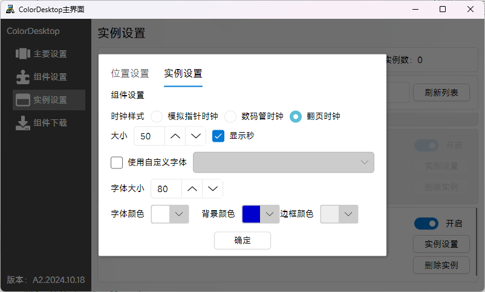
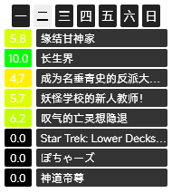
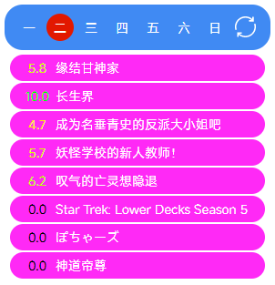
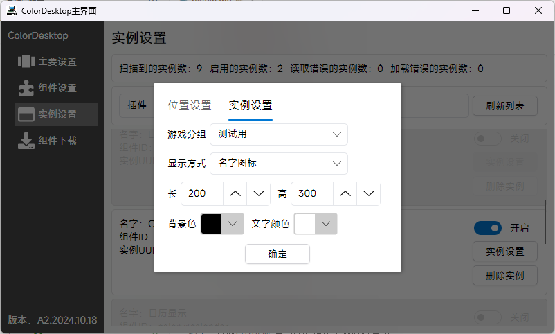
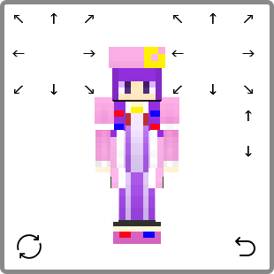

# 组件列表

|  组件ID   | 组件名  |  图标  |  简介  | 依赖组件  |
|  ----  | ----  | ----  | ----  | ----  |
| coloryr.analogclock  | [模拟时钟](#模拟时钟) |  | 使用表盘方式显示系统时间 | coloryr.clock,coloryr.corelib |
| coloryr.bm  | [每日番剧](#每日番剧) |  | 用于查询每日番剧 | coloryr.corelib |
| coloryr.calendar  | [日历](#日历) |  | 使用显示系统年月日 | coloryr.clock,coloryr.corelib |
| coloryr.clock  | [时钟](#时钟) |  | 用于展示当前系统时间 | coloryr.corelib |
| coloryr.corelib  | 核心库 |  | 用于给其他插件提供API |  |
| coloryr.live2d  | [Live2D模型](#Live2D模型) |  | 用于显示Live2D模型 | coloryr.corelib |
| coloryr.monitor  | [硬件监控](#硬件监控) |  | 获取电脑传感器信息 | coloryr.corelib |
| coloryr.oneword  | [每日一言](#每日一言) |  | 获取并显示每日一言 | coloryr.corelib |
| coloryr.pglaunher.colormc  | [ColorMC启动器](#ColorMC启动器) |  | 用于启动ColorMC游戏实例 | coloryr.corelib,coloryr.pglaunher |
| coloryr.pglaunher  | [程序启动器](#程序启动器) |  | 用于启动进程 | coloryr.corelib |
| coloryr.weather  | [天气](#天气) |  | 通过网络API查询并显示天气 | coloryr.corelib |
| coloryr.minecraft.skin  | [Minecraft皮肤显示](#Minecraft皮肤显示) |  | 用于显示Minecraft皮肤 | coloryr.corelib |
| coloryr.minecraft.motd  | [Minecraft服务器Motd显示](#Minecraft服务器Motd显示) |  | 用于显示Minecraft服务器Motd | coloryr.corelib |

## 模拟时钟

时钟有三种样式

- 样式1为指针时钟  

- 样式2为数码管时钟  

- 样式3为翻页时钟  

## 每日番剧

有三种样式

- 样式1为原始数据显示  
  

- 样式2为新皮肤显示  
  

- 样式3为图片显示  
  

## 日历

有三种样式
- 样式1为背景字  
  
  

- 样式2为日历皮肤  
  
  

- 样式3为日历皮肤  
  
  

## 时钟

用于显示当前时间，或者NTP时间  

显示样式  
  

## Live2D模型

直接显示Live2D模型，需要安装cubism core  

模型显示可以进行设置  
  
  
右键可以播放动画等  

## 硬件监控

直接显示传感器数据，需要用户自己设置  
  
  
调整好的效果  

## 每日一言

简单的从网上获取每日一言
  

## ColorMC启动器

读取ColorMC启动器的游戏实例然后启动  
  
  

## 程序启动器

直接启动电脑的应用程序  
  

## 天气

获取网络天气，可以设置更新间隔  

显示天气地区可以调整  
  
  

## Minecraft皮肤显示

可以显示Minecraft皮肤，可以从三种方式获取皮肤  
- 游戏ID
- 网络地址
- 本地文件

  

## Minecraft服务器Motd显示

获取Minecraft服务器的Motd然后显示  
  
