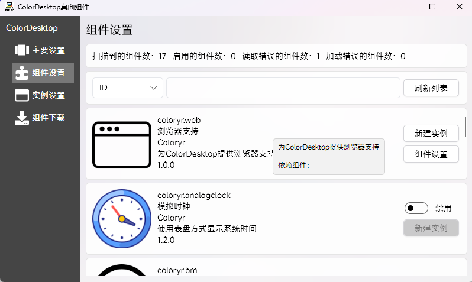

# 浏览器组件支持

这个是浏览器组件开发指南，[前往c#组件](./dev.md)

现在ColorDesktop支持使用html与js编写组件  

## 安装支持器

ColorDesktop需要`A3.20241211`及以上版本

下载并编译源码，需要先安装[dotnet 8 SDK](https://dotnet.microsoft.com/en-us/download/dotnet/8.0)
```
git clone https://github.com/Coloryr/ColorDesktop.git
cd ColorDesktop/src
dotnet build
```

然后在`src/build_out/Debug/net8.0`得到文件夹`WebPlugin`，这是就是支持器，将这个文件夹复制到你的`ColorDesktop`根目录下即可

重启`ColorDesktop`后，在组件列表找到  
  
则表示浏览器组件支持已成功加载

## 浏览器组件安装

浏览器组件统一安装在`./WebPlugin/plugins/`下面   
```
- ./WebPlugin/plugins/
    - webplugindemo/
        - index.html
        - plugin.json
        - ...
    - ... 
```

## 组件编写
[参考示例](./src/Demo/webplugindemo/)  
这是一个Vue3+Vite项目，编写前请确保安装了[nodejs](https://nodejs.org/)

浏览器组件若正常工作需要使用[colordesktop-webapi](./src//ColorDesktop.WebApi/)，这里面包含了和ColorDesktop通信的内容，包括实例窗口设置，实例设置，配置文件等  

首先你需要新建一个实例，然后注册
```ts
class Desktop implements IInstance {
    showSetting(): void {
        
    }
    closeSetting(): void {
        
    }
    start(_window: IInstanceWindow | null): void {
        
    }
    stop(_window: IInstanceWindow | null): void {
        
    }
    renderTick(): void {

    }
    update(_obj: InstanceDataObj): void {
        
    }
    getHandel(): IInstanceHandel | null {
        return null
    }
}
//注册
colordesktop.register(new Desktop())
```
这样ColorDesktop才会控制该显示实例的完整生命周期，否则会强制销毁

在全局中，有一个名为`colordesktop`的实例，你可以使用下面的接口进行操作
```ts
export declare class ColorDesktop {
    /**
     * 获取实例
     * @returns 实例
     */
    getInstance(): IInstance | null;
    /**
     * 获取操作句柄
     * @returns 句柄
     */
    getHandel(): IInstanceHandel | null;
    /**
     * 获取窗口控制器
     * @returns 控制器
     */
    getWindow(): any;
    /**
     * 设置窗口控制器
     * @param window 控制器
     */
    setWindow(window: any): void;
    /**
     * 获取实例控制器
     * @returns 实例控制器
     */
    getWindowhandel(): IInstanceWindow | null;
    /**
     * 注册ColorDestop显示实例
     * @param plugin 显示实例
     */
    register(plugin: IInstance): void;
    /**
     * 设置配置文件
     * @param name 文件名，不带.json
     * @param config 内容
     */
    setConfig(name: string, config: any): Promise<void>;
    /**
     * 获取配置文件
     * @param name 文件名，不带.json
     * @returns 内容
     */
    getConfig(name: string): Promise<any>;
}
```
还有一个叫`colordesktop_window`窗口句柄，可以让你直接控制窗口
```js
await colordesktop_window.setState(state)
await colordesktop_window.setTran(tran)
await colordesktop_window.move(x, y)
await colordesktop_window.resize(x, y)
await colordesktop_window.activate()
await colordesktop_window.show()
await colordesktop_window.close()
```